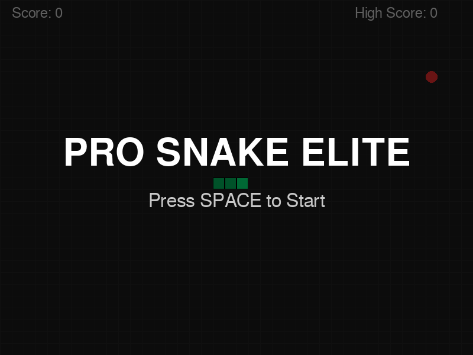

# Pro Snake Elite

A professional, high-performance implementation of the classic Snake game built with Python and Pygame.

 *(Run the game to see it in action!)*

## Features

- **Modern Visuals**: Sleek dark theme with a grid background and smooth rendering.
- **Dynamic Difficulty**: Snake speed increases as you eat more food, providing a challenging experience.
- **State Management**: Robust game states including Main Menu, Pause, and Game Over.
- **Persistent High Scores**: Automatically saves and loads your highest score.
- **Object-Oriented Design**: Clean, modular code structure following professional standards.
- **Cross-Platform**: Runs on any system with Python and Pygame installed.

## Installation

1. **Clone the repository**:
   ```bash
   git clone <repository-url>
   cd snake-game
   ```

2. **Install dependencies**:
   ```bash
   pip install pygame
   ```

3. **Run the game**:
   ```bash
   python main.py
   ```

## Controls

| Key | Action |
|-----|--------|
| **Arrow Keys** | Move Snake |
| **P** | Pause / Resume |
| **Space** | Start Game / Restart (Game Over) |
| **Close Window** | Exit Game |

## Project Structure

- `main.py`: Entry point for the game.
- `src/`: Source code directory.
  - `engine.py`: Core game engine and state management.
  - `snake.py`: Snake logic and movement.
  - `food.py`: Food spawning and rendering.
  - `constants.py`: Game-wide settings and colors.
- `archive/`: Original basic implementations for reference.

## Development

The project is structured to be easily extendable. You can modify `src/constants.py` to change game dimensions, colors, or speed settings.

### Adding New Features

- **Sounds**: Add audio files and initialize them in `GameEngine.__init__`.
- **Power-ups**: Extend the `Food` class or create a new `PowerUp` class.
- **Themes**: Add more color palettes to `constants.py`.

---
Developed with ❤️ by Jules.
